# Build Gallery

Photos and clips from the build, in chronological order. Metadata (EXIF/GPS)
has been stripped from every file, and filenames are `NN-YYYY-MM-DD-subject`.

## Teardown — Feb 2026

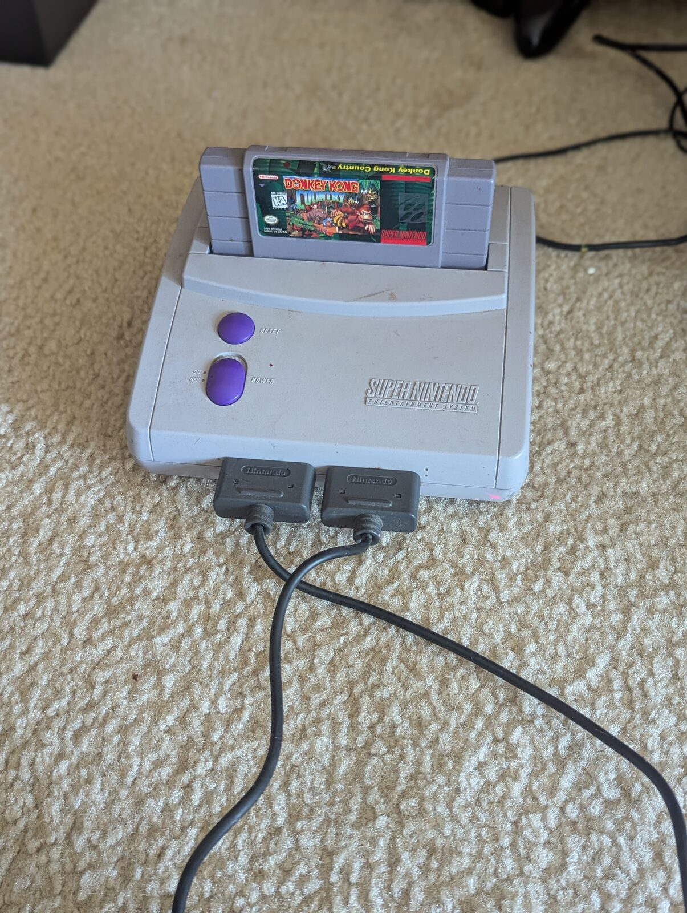
*01 — The starting point: a stock SNES Jr with a cartridge loaded.*

🎬 [02 — clip: the unmodified console before the Pi goes in](02-2026-02-18-snes-console-cartridge-demo.mp4)

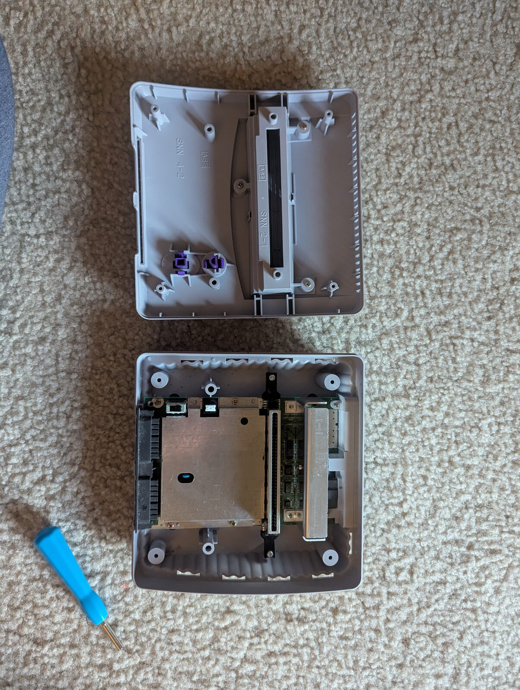
*03 — The SNES controller opened up: shell halves and the button-contact PCB.*

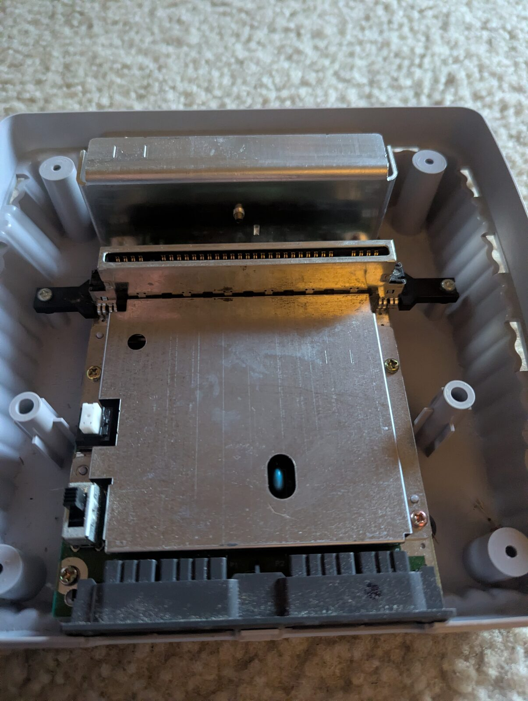
*04 — Inside the console shell — cartridge slot, shielded mainboard, controller ports.*

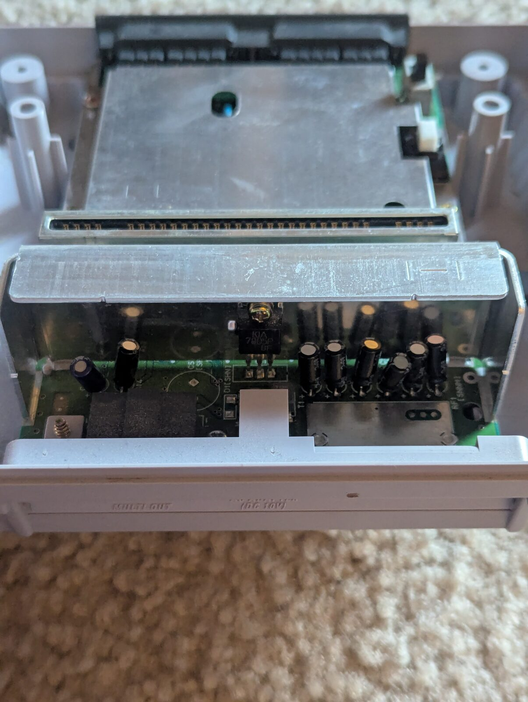
*05 — Top shell off, main PCB exposed.*

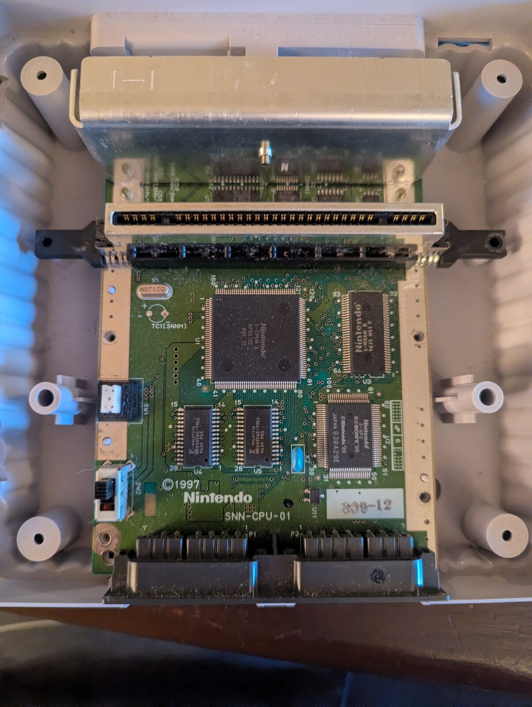
*06 — The SNES Jr mainboard (SNN-CPU-01, 1997).*

🎬 [07 — clip: console with cartridge and controller cable on the front port](07-2026-02-22-snes-console-cables-setup.mp4)

## Reassembled — Mar–Apr 2026

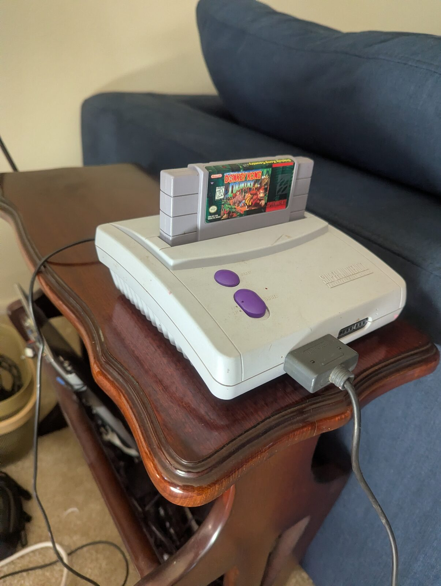
*08 — Buttoned back up with cartridge and controller.*

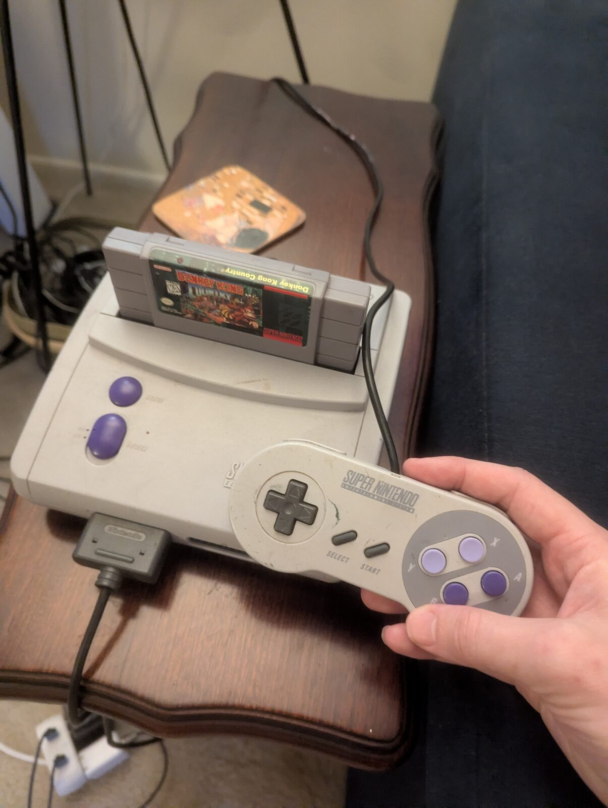
*09 — Original controller plugged in and working.*

## Pi integration — Jun 2026

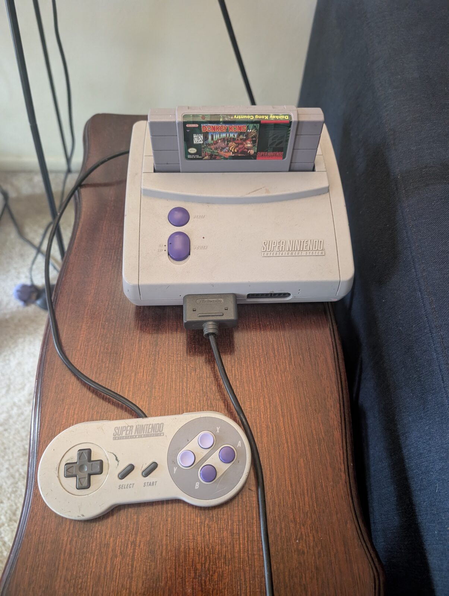
*10 — Console and controller, ready for the Pi tap.*

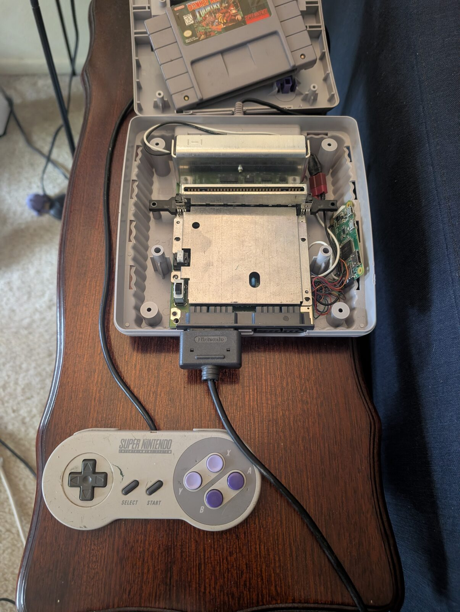
*11 — Pi Zero W and wiring tucked in alongside the original motherboard.*

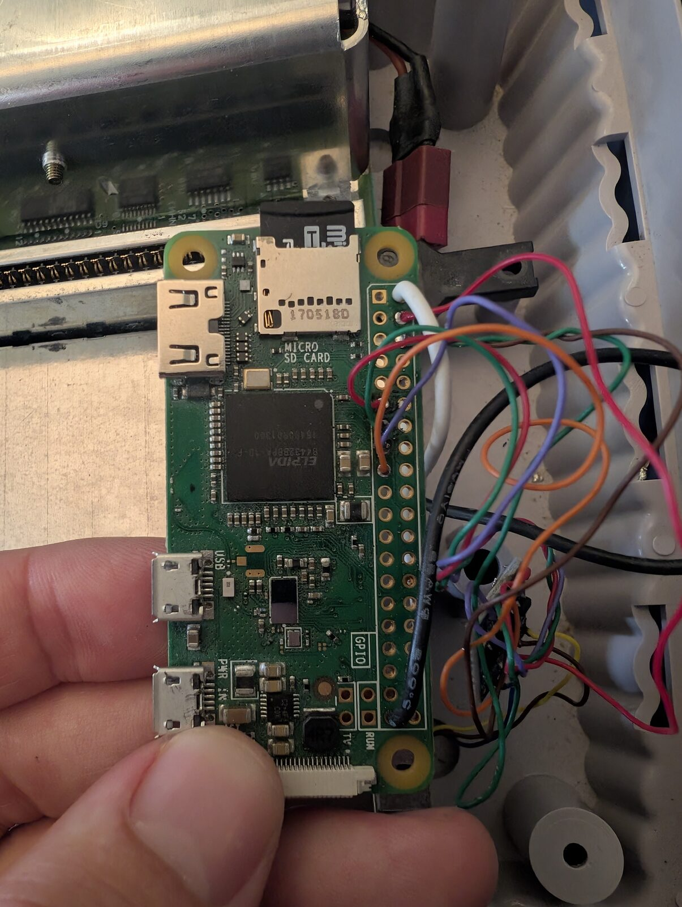
*12 — GPIO jumpers on the Pi's 40-pin header.*

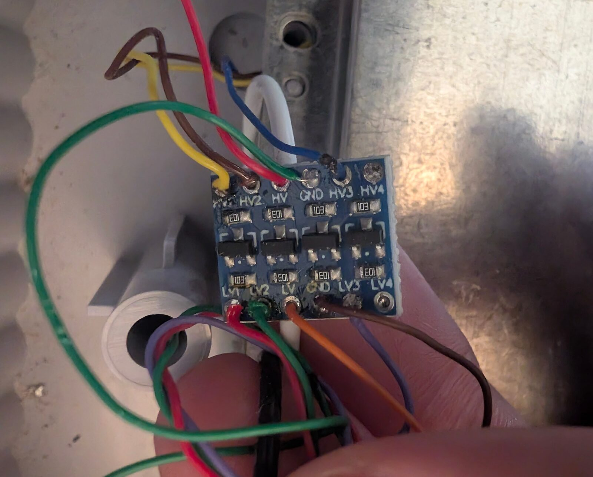
*13 — The level-shifter module dropping the 5V controller signals to 3.3V.*

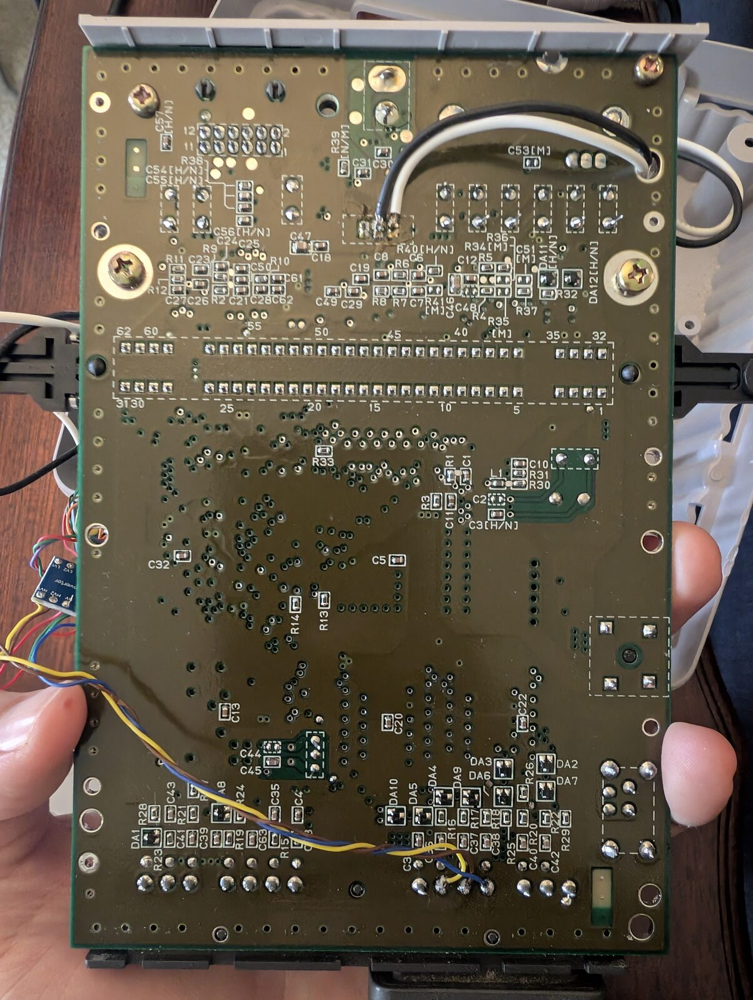
*14 — Tap wires soldered to the controller PCB's Clock / Latch / Data traces.*

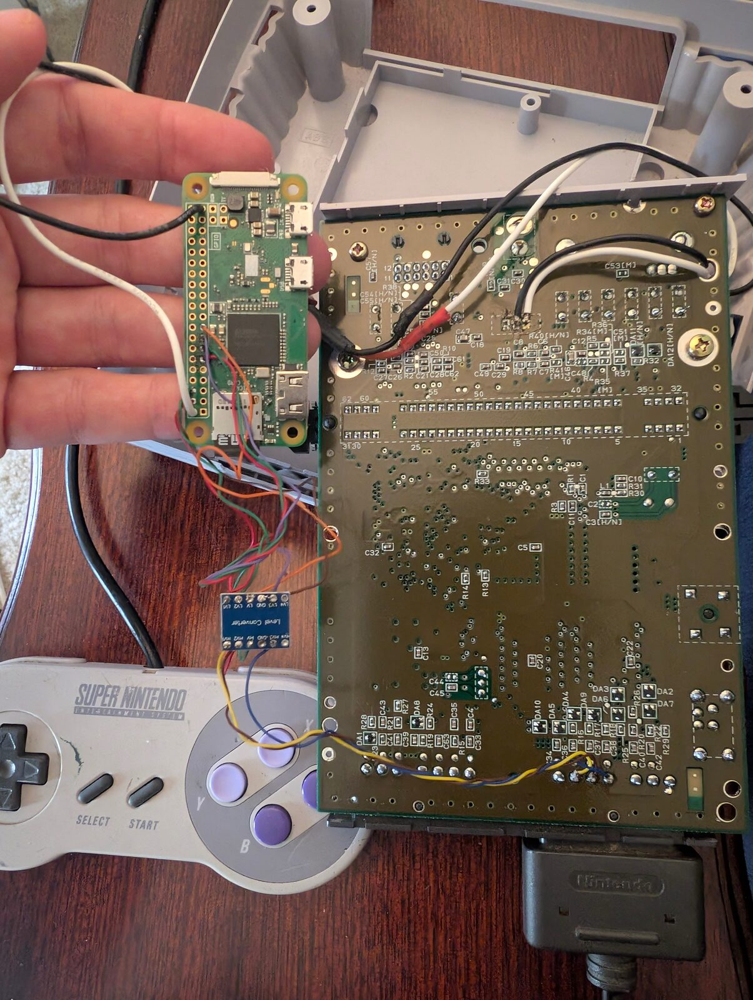
*15 — The full passive tap wired up: controller signals → level shifter → Pi GPIO.*
